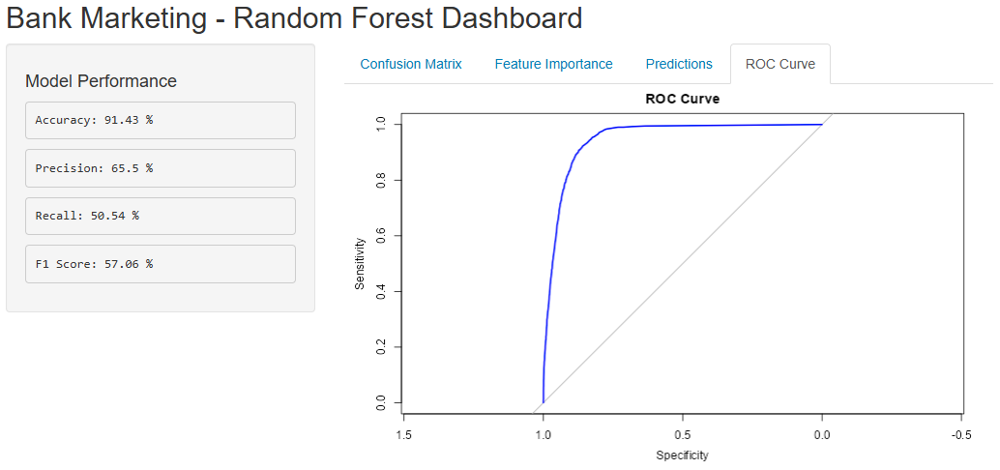

# 🧠 Bank Marketing - Random Forest Dashboard


## 📦 Dataset: Bank Marketing (`bank-additional-full.csv`)
- **Source**: UCI Machine Learning Repository
- **Goal**: Predict whether a client will subscribe to a term deposit
- **Target Variable**: `y` (values: `"yes"` or `"no"`)
- **Records**: 41,188
- **Features**: 20+ (including `age`, `job`, `education`, `duration`, `poutcome`, `emp.var.rate`)

---

## 🔍 Preprocessing
- Converted all character columns to factors
- Split data:
  - **80% training**
  - **20% testing**
- Reproducible with `set.seed(123)`

---

## 🌲 Model: Random Forest Classifier
- Trained on all features to predict `y`
- Parameters:
  - `ntree = 3`

### 📊 Model Metrics (on test set)
| Metric     | Value     |
|------------|-----------|
| Accuracy   | 91.43%    |
| Precision  | 65.50%    |
| Recall     | 50.54%    |
| F1 Score   | 57.06%    |

---

## 🖥️ Shiny Dashboard Features

### 📈 Sidebar
- Accuracy
- Precision
- Recall
- F1 Score

### 🔍 Tabs
- **Confusion Matrix**: Heatmap using `ggplot2`
- **Feature Importance**: Table view of top variables
- **Predictions**: First 6 predictions with total count
- **ROC Curve**: Plots True Positive Rate vs. False Positive Rate

---

## 📁 Project Structure

```
/RANDOM-FOREST
├── data/
│   └── bank-additional-full.csv
├── random-forest-model.r   # model training, predictions, metrics
├── app.r                   # Shiny dashboard consuming results
├── renv/                   # R environment tracking
```

---

## 📌 Notes

- All data and model objects are stored in `rf_dashboard` (a shared environment).
- `random-forest-model.r` is sourced inside `app.r` to keep logic modular.
- No model is saved — everything runs in memory.

---

## 💡 Potential Next Steps
- Add row selector or pagination to prediction table
- Allow retraining with different `ntree` settings
- Visualize feature importance as a bar chart
